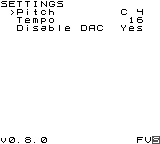

# Bytewave (Game Boy ROM)

An experiment heavily inspired by [bytebeat](http://canonical.org/~kragen/bytebeat/), which generates and plays a sound using a wave channel (CH3).
Bytebeat formulas used in the code taken from [`bytebeat_formulas.txt`](http://viznut.fi/demos/unix/bytebeat_formulas.txt) and [Bytebeat composer](https://dollchan.net/bytebeat/).

## Controls

### General

- `Select` + `Right` / `Left` - Next / Previous screen
- `Start` - Play / Stop

### `FUNC` Screen

- `Up` / `Down` - Move cursor up / down (Select function)

### `SETTINGS` Screen

- `Up` / `Down` - Move cursor up / down (Select option)
- `A` + `Right` / `Left` - Increase / Decrease value
- `A` + `Up` / `Down` - Pitch only: Next / Previous octave

## Build from source (Linux)

1. Clone the repository.
2. Build the ROM from source code using the `make` command.

## Screenshots

## Special Thanks

- [GBDK-2020](https://github.com/gbdk-2020/gbdk-2020)
- [Pan Docs](https://gbdev.io/pandocs/)
- [Gameboy Development Forum](https://gbdev.gg8.se/forums/index.php)
